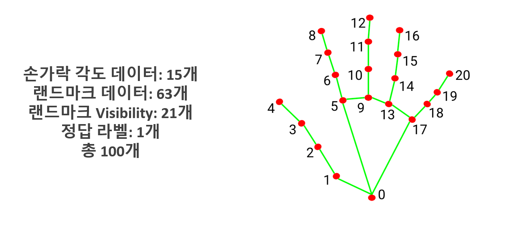

## Camera와 Mediapipe를 이용하여 TrackPad를 구현하였습니다.

### 총 4단계를 거쳐서 진행한 Project이며, 각 단계는 아래와 같습니다.

#### 1. 학습 데이터 수집
#### 2. 학습 데이터 전처리 과정
#### 3. 학습 데이터 학습
#### 4. 학습데이터 검증
#### 5. TrackPad 구현

# Mediapipe 소개
Mediapipe는  Google에서 개발한 오픈 소스 프레임워크로, 컴퓨터 비전 및 머신 러닝 기술을 쉽게 구현하고 배포할 수 있도록 도와주는 도구입니다. MediaPipe를 사용하면 비디오, 오디오, 이미지 등 다양한 형식의 데이터를 처리하고 분석하는 데 사용할 수 있습니다.
아래 사진과 같이 각 관절마다 번호를 부여하여 각 관절의 위치를 좌표값으로 받아와 마우스의 커서와 기능을 구현하였습니다.

# 1. 학습 데이터 수집

학습 데이터는 직접 카메라로 다양한 제스처를 찍으며 총 1024개의 영상을 직접 만들어서 제작 하였습니다.

# 2. 학습 데이터 전처리 과정

1번 과정에서 생성한 데이터들을 Numpy 형태의 데이터로 추출을 합니다.

Numpy에는 index 0번 부터 index 20번 까지의 x, y좌표값을 받아오며 프레임 단위로 Numpy 배열을 생성합니다.

    if results.multi_hand_landmarks:
        for hand_landmarks in results.multi_hand_landmarks:
            # 각 랜드마크의 x, y 좌표 추출
            landmarks = []
            for id, lm in enumerate(hand_landmarks.landmark):
                h, w, c = frame.shape
                cx, cy = int(lm.x * w), int(lm.y * h)
                landmarks.extend([cx, cy])
            
            return np.array(landmarks)

# 3. 학습 데이터 학습

